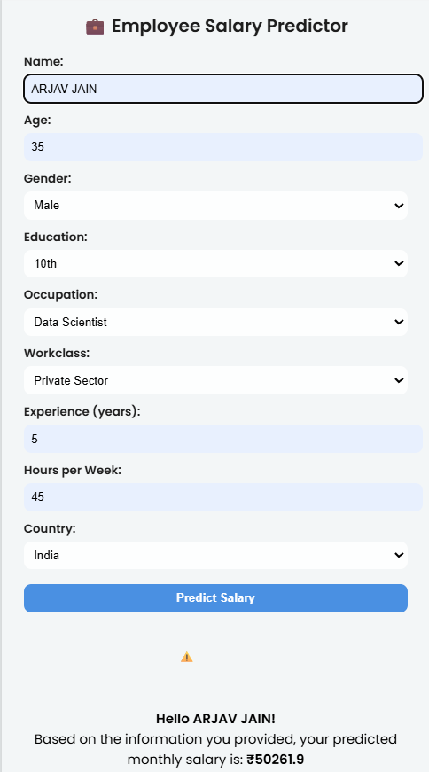
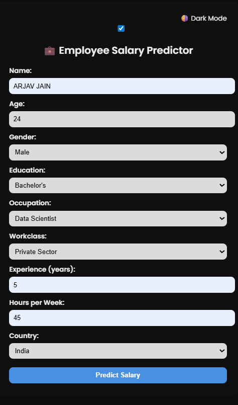
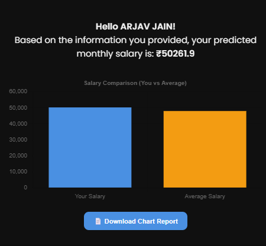

# 💼 Employee Salary Predictor

A smart, responsive, and ML-powered web application that predicts an employee’s **monthly salary** based on their age, gender, education, experience, occupation, working hours, and country. This project combines a trained machine learning model with a modern frontend UI using Flask, Chart.js, Lottie animations, and PDF export functionality.

🚀 **Live App:**  
🔗 [https://employee-salary-predictor-web-app-js5t.onrender.com/](https://employee-salary-predictor-web-app-js5t.onrender.com/)

---

## 📸 Screenshots

| Home Page | Dark Mode | Salary Chart |
|-----------|-----------|--------------|
|  |  |  |

---

## 🧠 Features

- ✅ Machine Learning–powered salary predictions
- ✅ Responsive UI with Light/Dark Mode toggle
- ✅ Real-time salary comparison chart (You vs Average)
- ✅ Personalized greeting based on user name
- ✅ PDF download of the chart for reporting
- ✅ Lottie animations for modern UX
- ✅ Mobile-friendly and fully deployable

---

## 📊 Tech Stack

| Layer     | Technology |
|-----------|------------|
| 🧠 Backend  | Python, Flask, scikit-learn |
| 📦 Model I/O | joblib |
| 🎨 Frontend | HTML5, CSS3, JavaScript, Chart.js, Lottie, jsPDF |
| ☁ Deployment | Render.com |
| 📁 Structure | MVC with Jinja2 templating |

🧪 Sample Input

| Field      | Example        |
| ---------- | -------------- |
| Name       | Arjav Jain     |
| Age        | 24             |
| Gender     | Male           |
| Education  | Bachelor's     |
| Occupation | Data Analyst   |
| Workclass  | Private Sector |
| Experience | 2              |
| Hours/week | 40             |
| Country    | India          |

💰 Output: Salary prediction + comparison bar chart + downloadable report
---
📁 Project Structure
employee-salary-predictor/
├── app.py
├── salary_model.pkl
├── requirements.txt
├── Procfile
├── README.md
├── templates/
│   └── index.html
├── static/ (optional)
│   └── style.css / JS / images

✍️ Author
Arjav Jain
🎓 Final Year BCA Student | 💼 Aspiring Data Analyst
🔗 LinkedIn
