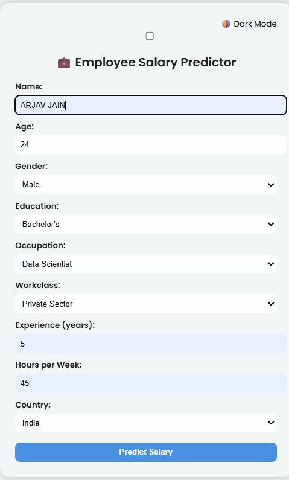

# 💼 Employee Salary Predictor

A smart, responsive, and ML-powered web application that predicts an employee’s **monthly salary** based on their age, gender, education, experience, occupation, working hours, and country. This project combines a trained machine learning model with a modern frontend UI using Flask, Chart.js, Lottie animations, and PDF export functionality.

🚀 **Live App:**  
🔗 [https://employee-salary-predictor-web-app-js5t.onrender.com/](https://employee-salary-predictor-web-app-js5t.onrender.com/)

---

## 📸 Screenshots

| Home Page | Salary Chart | Dark Mode|
|-----------|-----------|--------------|
|  |  |  |

---

## 🧠 Features

- ✅ Machine Learning–powered salary predictions
- ✅ Responsive UI with Light/Dark Mode toggle
- ✅ Real-time salary comparison chart (You vs Average)
- ✅ Personalized greeting based on user name
- ✅ PDF download of the chart for reporting
- ✅ Lottie animations for modern UX
- ✅ Mobile-friendly and fully deployable

---

## 📊 Tech Stack

| Layer     | Technology |
|-----------|------------|
| 🧠 Backend  | Python, Flask, scikit-learn |
| 📦 Model I/O | joblib |
| 🎨 Frontend | HTML5, CSS3, JavaScript, Chart.js, Lottie, jsPDF |
| ☁ Deployment | Render.com |
| 📁 Structure | MVC with Jinja2 templating |

🧪 Sample Input

| Field      | Example        |
| ---------- | -------------- |
| Name       | Arjav Jain     |
| Age        | 24             |
| Gender     | Male           |
| Education  | Bachelor's     |
| Occupation | Data Analyst   |
| Workclass  | Private Sector |
| Experience | 2              |
| Hours/week | 40             |
| Country    | India          |
📂 Project Folder Structure
-Employee-Salary-Predictor/
│
├── app.py                # Flask backend logic
├── train_model.py        # Script to clean, train, and save model
├── requirements.txt      # All dependencies
├── adult 3.csv           # Cleaned input dataset
│
├── model/                # Saved ML model and preprocessing files
│   ├── income_model.pkl
│   ├── standard_scaler.pkl
│   ├── model_columns.pkl
│   └── label_encoders.pkl
│
├── templates/
│   └── index.html        # Complete frontend with form + charts + PDF
│
├── assets/               # Screenshots or static assets
│   └── form.png
│   └── result.png
│
└── README.md             # This file

⚙️ How to Run Locally
git clone https://github.com/arjav527/-Employee-Salary-Predictor.git
cd -Employee-Salary-Predictor

# Optional: Create virtual environment
python -m venv venv
venv\\Scripts\\activate   # Windows
# source venv/bin/activate  # Mac/Linux

pip install -r requirements.txt

# Run the app
python app.py
Then open http://127.0.0.1:5000 in your browser.

🔁 Model Training Explanation
You can retrain the model by running:
python train_model.py
Loads & cleans the dataset

Maps income >50K → ₹60K and <=50K → ₹30K

Converts it into monthly salary

Label-encodes categorical features

Scales numerical data

Trains a Linear Regression model

Saves .pkl files for use in prediction

🧠 How Prediction Works
User enters details in a clean web form

Flask backend receives form via POST

Input is encoded using saved LabelEncoders

Scaled using StandardScaler

Regression model (income_model.pkl) predicts real salary (₹)

Result is shown with:

Name

Salary value

Chart.js bar chart

PDF Download button
button

📩 Output Example

Hello Arjav!
Your estimated monthly salary is ₹ 43,500

👨‍💻 Author
Arjav Jain
📌 [GitHub](https://github.com/arjav527/)
📩 arjavjain062@gmail.com
#machinelearning #flaskapp #salarypredictor #python #webapp #datascience #chartjs #pdfreport

